# Health-Care-Management-System
A secure healthcare management system, built using Django, for the project component of the FCS Monsoon 2022 offering.

### Login

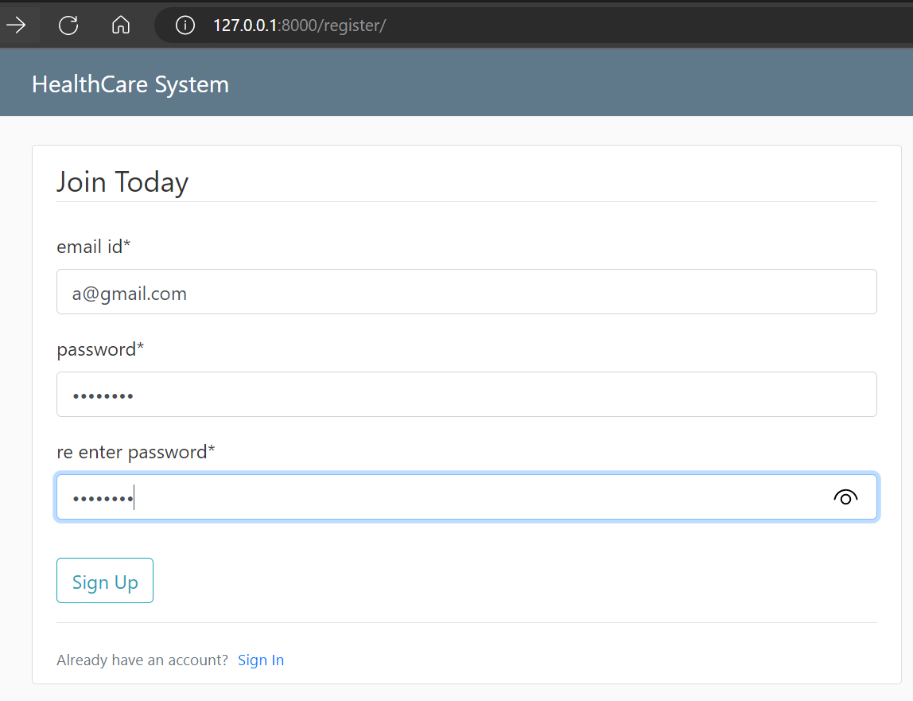

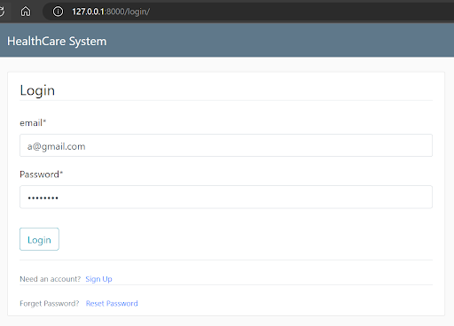

### OTP Verification
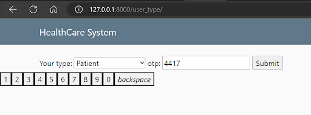

### Profile Update
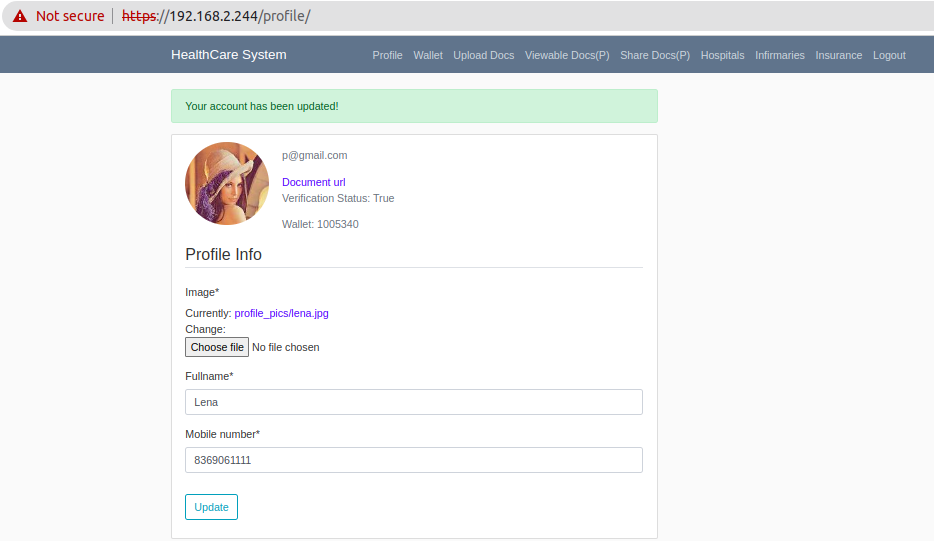

### Upload Documents

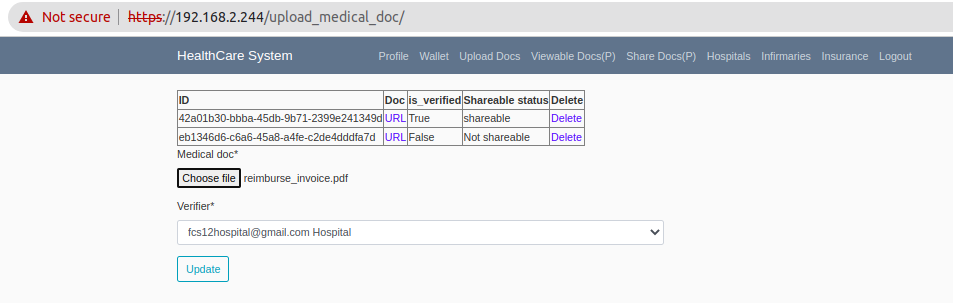

### Share Documents

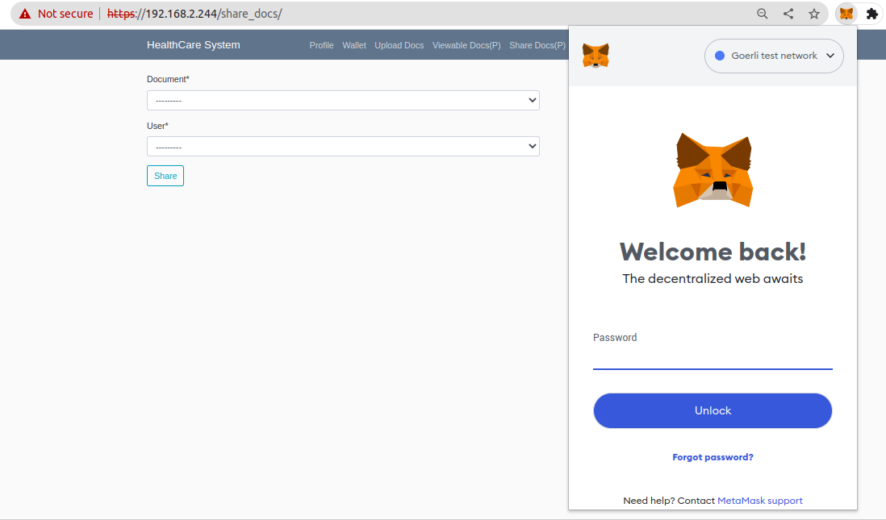

### View Shared Documents

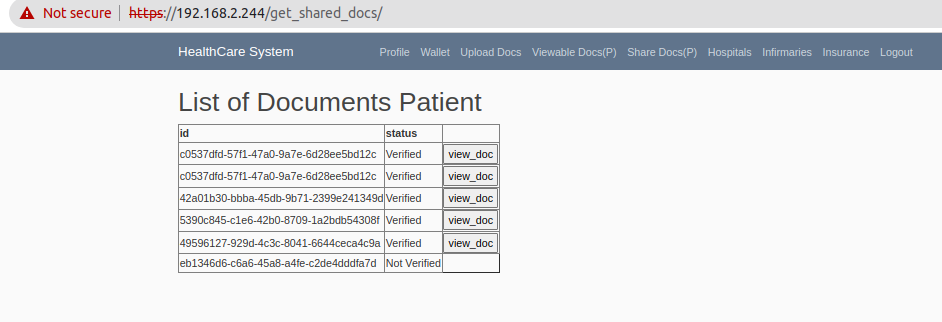

### Browse Hospitals

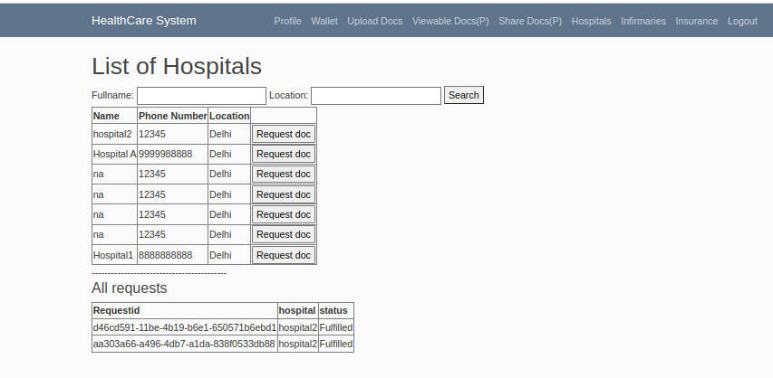

### Browse Infirmaries

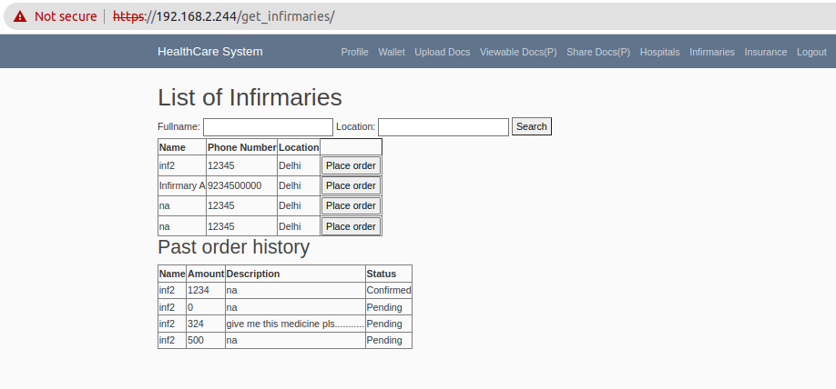

### Browse Insurance Companies

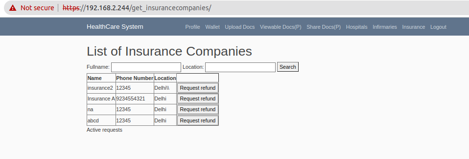

### Request Refund from Insurance Companies

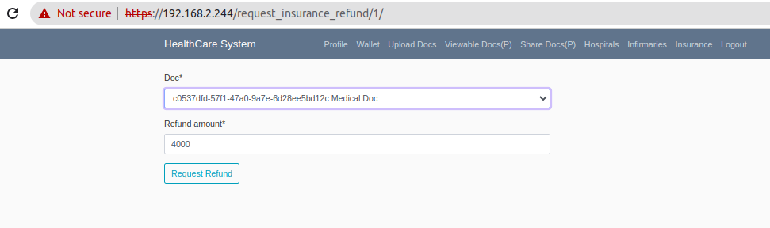
